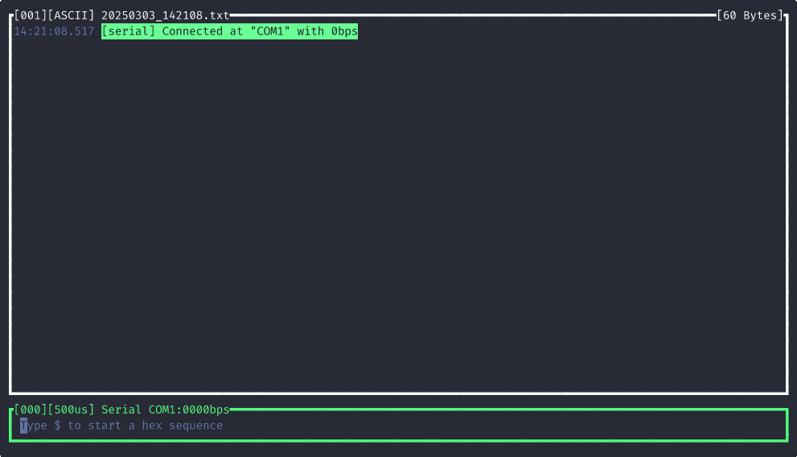

<p align="center">
    <br>
    <br>
    <a href="https://opensource.org/licenses/BSD-3-Clause"></a>
    <a href="https://crates.io/crates/scope-monitor"></a>
    <br><b>Scope</b> is a multi-platform serial monitor with user-extensible features.
</p>

<p align="center">
    <a href="#send-data">Key Features</a> •
    <a href="#scope-vs-others">Scope vs Other</a> •
    <a href="#installation">Installation</a> •
    <a href="#how-to-use">How to Use</a> •
    <a href="#project-goals">Project Goals</a>
</p>

### Send Data

With `Scope`, you can type a message on the command bar (at bottom) and hit `Enter` to send it through the serial port.


### Send in Hexadecimal

You also can send bytes in hexadecimal. To do it, type `$` and write your bytes in a hexadecimal format. The message can have spaces and commas as separators (`Scope` will send the bytes of message without spaces and commas).


### Send Commands

> [!WARNING]
> The commands were removed at v0.3.0 and will be replaced for `tag` syntax in future versions. The `tag` syntax will be more powerful and flexible than commands.

### Written History

It's possible to retrieve old data sent. You can hit `Up Arrow` and `Down Arrow` to navigate through the history of sent data.


### Auto Reconnect

The `Scope` tool has an auto-reconnect feature. When the serial port isn't available, `Scope` will keep trying to reconnect to the serial port until it's available again.



> [!NOTE]
> There are some issues for auto reconnect in Windows version.

### Colorful

`Scope` colors the command bar to notify the status of the serial connection: red to disconnected and green to connected. Beyond status, the content read and written are colored too. The messages read is colored using ANSI terminal color standard.


The data sent to serial port always has a background to differentiate it from read data. Characters outside the printable range of the ASCII table are shown in magenta and in the hexadecimal format. Some characters are printed as its representation, such as: `\n`, `\r` and `\0`.


### Setup Serial Port

It's possible change serial port and its baud rate while the tool is open. To do that,
type `!serial connect COM4 9600` to set serial port to `COM4` and baud rate to `9600`. You can also omit port to change only the baud rate (`!serial connect 9600`) or omit the baud rate to change only the port (`!serial connect COM4`). If you want to release the serial port, you'll type `!serial disconnect`.


### Save history

To save the all messages captured (and sent) since the start, you can hit `Ctrl+s`. The history box will blink and a message will be displayed on history. The filename is shown at top of history box with `.txt` extension. There is, at the history's top-right corner, the size of all message captured.


However, if you want to save only the message captured from now, you'll use the record feature. Hitting `Ctrl+r`, you'll start a record session. While in a record session, the history block is yellow and the `Scope` will store all messages captured from now. To stop the record session, you need to hit `Ctrl+r` again. The right-corner indicator will show the size of the record session. A new filename is created each time a new record session is started. Both: start session and stop session, prints a message on the history box to indicate when it occurs.


### Message Timestamp

All the data written or read has a gray timestamp on the left of the message and with the following
format: `HH:MM:SS.ms`.

### Multiplatform

You can use `Scope` on multiple platforms, like: Linux, Windows and macOS (Apple Silicon).

### History Navigation

You can navigate through the message history using the mouse wheel or hitting `PageUp` and `PageDown`.

### Plugins

You can extend the basic functions of `Scope` using plugins! Plugins are scripts written in `lua` language. The code below shows a plugin that appends `Received:` at the beginning of received message. It also sends `Hello, World\r\n` via serial and the user type `!echo hello` (if the plugin name is `echo.lua`) on the command bar.

```lua
local log = require("scope").log
local fmt = require("scope").fmt

local M = {}

function M.on_serial_recv(msg)
  log.info("Received: " .. fmt.to_str(msg))
end

function M.hello()
  log.info("Hello, World!")
end

return M
```

To call your plugin you need to type `!` followed by your plugin name and a list of arguments. Inside your plugin, is possible to do many action to interact with `Scope` and serial port, such as: connect to a serial port, disconnect from the serial port, send data to serial port, print some message in `Scope` text view and so on. For more information about the development of plugins for `Scope` you can read the [Plugins Developer Guide](plugins/README.md).


## Scope vs Others

The `Scope` combine multiple features. The table below list these features:

| Features                    | Scope (Free) | Docklight | Arduino | Tera Term | screen   | esp-idf  |
|-----------------------------|--------------|-----------|---------|-----------|----------|----------|
| Send Data                   | ✅            | ✅        | ✅       | ✅         | ✅        | ✅        |
| Send in Hexadecimal         | ✅            | ✅        | x        | x         | x        | x        |
| Send Commands               | x[^1]         | ✅        | x       | x          | x        | x        |
| Written History             | ✅            | ✅[^2]    | x        | x         | x        | x        |
| Auto Reconnect              | ✅            | ✅        | x        | ✅         | x        | x        |
| Colorful                    | ✅            | x         | x       | ✅         | ✅        | ✅        |
| Message Timestamp           | ✅            | ✅        | x        | x         | x        | x        |
| Display non-printable chars | ✅            | ✅        | x        | x         | x        | x        |
| Plugins                     | ✅            | ✅        | x        | x         | x        | x        |
| Multiplatform               | ✅            | Windows   | ✅       | Windows   | Linux    | ✅        |
| Interface                   | TUI           | GUI       | GUI     | GUI       | Terminal | Terminal |
| Price                       | Free          | €69       | Free    | Free      | Free     | Free     |

<br>[^1]: Will be replaced by `tag` syntax in next versions
<br>[^2]: The Docklight has a list of commands in lateral panel, so it doesn't need a command history

## Installation

You can use `cargo` to install `Scope`, download a pre-built binary at [Releases](https://github.com/matheuswhite/scope-rs/releases) page, or compile it from source (using this repository).

### Using `cargo`

```shell
cargo install scope-monitor
```

## How to Use

After the installation, type `scope serial` followed by the serial port and the desired baud rate. For example, to open the port `COM3` at `115200 bps` type:

```shell
scope serial COM3 115200
```

When the command bar at the bottom is green, it starts to capture messages from serial port and allows for sending messages.

## Project Goals

This project has 5 pillars that will direct the development of this tool:

I. **Intuitive Usage:** The usage of the tool must be intuitive. This means the usability should follow other popular tool's common behaviors. For example, the history navigation (`Up Arrow` and `Down Arrow`) follows the history navigation of OS terminal like in the Unix shell and in the Windows Powershell.
<br>II. **Compactness and Orthogonality:** The features must follow the [compactness and orthogonality](http://www.catb.org/esr/writings/taoup/html/ch04s02.html) principles of the Unix.
<br>III. **User Centric Development:** The development of this tool must deliver value to user in the first place, instead of pleasing the developers. For example: the script language used to extend the tool must be a consolidated programming language, instead of creating a new language. Another example is to prioritize critical bugs reported by users, instead of launch new features.
<br>IV. **Multiplatform:** All releases must work in Windows, Linux (zsh, shell and fish) and macOS.
<br>V. **Extensible:** Support user scripts to extend base functionalities. These scripts are called plugins. For more information about plugins see [Plugins Developer Guide](plugins/README.md)

The roadmap, with next releases, may be found in [GitHub project](https://github.com/users/matheuswhite/projects/5) of this tool.

## Community

For new feature requests and to report a bug, feel free to post a new [issue](https://github.com/matheuswhite/scope-rs/issues) on GitHub.

## Contributing

Take a look at the [CONTRIBUTING](CONTRIBUTING.md) guide

## Maintainers

+ [Matheus T. dos Santos](https://github.com/matheuswhite)

## Acknowledges

+ [Emilio Bottoni](https://github.com/MilhoNerfado) and [José Gomes](https://github.com/JoseGomesJr) for the ideas that pushes forward this tool, for the tests that finds hidden bugs and for good features implementations.

## License

Scope is made available under the terms of BSD v3 Licence.

See the [LICENCE](https://github.com/matheuswhite/scope-rs/blob/main/LICENSE) for license details.
