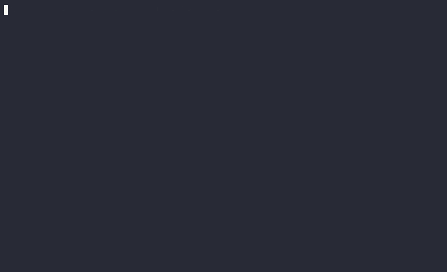

<p align="center">
    <br>
    <br>
    <a href="https://opensource.org/licenses/BSD-3-Clause"></a>
    <a href="https://crates.io/creates/scope-rs"></a>
    <br><b>Scope</b> is a multi-platform serial monitor with user-extensible features.
</p>

<p align="center">
    <a href="">Key Features</a> •
    <a>Scope vs Other</a> •
    <a>Installation</a> •
    <a>How to Use</a> •
    <a>Project Goals</a>
</p>

### Send Data

With `Scope`, you can type a message on the command bar (at bottom) and hit `Enter` to send it through the serial port.


### Send in Hexadecimal

You also can send bytes in hexadecimal. To do it, type `$` and write your bytes in a hexadecimal format. The message
can have spaces and commas as separators (`Scope` will send the bytes of message without spaces and commas).


### Send Commands

You can send commands using the command bar. To send a command, type `/` and a list of all available commands is
shown above the command bar. Continue typing the command and hit `Enter` to send the command.


The commands are loaded from a user YAML file, passed at start of program (using `-c` flag). An example of YAML file is
shown below:

```yaml
hello: 'world!'
spaces: 'a big frase with spaces'
double_quotes: '"double"'
single_quotes: "'single'"
json: '{"cmd":1, "args":[true, "hello", 2.1]}'
json_again: '{"cmd":2, "args":"world"}'
```

### Written History

It's possible to retrieve old data and commands sent. You can hit `Up Arrow` and `Down Arrow` to navigate through
the history of sent data and commands.


### Auto Reconnect

The `Scope` tool has an auto-reconnect feature. When the serial port isn't available, `Scope` will keep trying to
reconnect to the serial port until it's available again.



### Colorful

`Scope` colors the command bar to notify the status of the serial connection: red to disconnected and green to
connected. Beyond status, the content read and written are colored too. The messages read is colored using ANSI terminal
color standard.


The data sent to serial port always has a background to differentiate it from read data. Characters outside the
printable range of the ASCII table are shown in magenta and in the hexadecimal format. Some characters are printed as
its representation, such as: `\n`, `\r` and `\0`.


### Message Timestamp

All the data written or read has a gray timestamp on the left of the message and with the following
format: `HH:MM:SS.ms`.

### Multiplatform

You can use `Scope` on multiple platforms, like: Linux, Windows and macOS*.

*Not tested yet

### Plugins

You can extend the basic functions of `Scope` using plugins! Plugins are scripts written in `lua` language. To create a
plugin for `Scope` you'll need to write a lua script with these 2 functions: `serial_rx` and `user_command`.
The `serial_rx` function is called when a new data is captured on serial port. The `user_command` function is called
when you call your plugin from command bar, passing arguments to this command. The code bellow is a plugin to
reply `OK\r\n` when receive the `AT\r\n` message and to send `Hello, World\r\n` when the user type `!echo hello` on the
command bar.

```lua
require "scope"

function serial_rx(msg)
    msg_str = bytes2str(msg)

    if msg_str ~= "AT\r\n" then
        return
    end

    scope.println("Sending msg \"OK\" via serial tx...")
    scope.serial_tx(str2bytes("OK\r\n"))
    scope.println("Message sent!")
end

function user_command(arg_list)
    if arg_list[1] ~= "hello" then
        return
    end

    scope.println("Hello, World!\r\n")
end
```

To call your plugin you need to type `!` followed by your plugin name and a list of arguments. Inside your plugin, is
possible to do many action to interact with `Scope` and serial port, such as: connect to a serial port, disconnect from
the serial port, send data to serial port, print some message in `Scope` text view and so on. For more information about
the development of plugins for `Scope` you can read the [Plugins Developer Guide]().


## Scope vs Others

The `Scope` combine multiple features. The table below list these features:

| Features                    | Scope (Free) | Docklight | Arduino | Tera Term | screen   | esp-idf  |
|-----------------------------|--------------|-----------|---------|-----------|----------|----------|
| Send Data                   | ✅            | ✅         | ✅       | ✅         | ✅        | ✅        |
| Send in Hexadecimal         | ✅            | ✅         | x       | x         | x        | x        |
| Send Commands               | ✅            | ✅         | x       | x         | x        | x        |
| Written History             | ✅            | ✅*        | x       | x         | x        | x        |
| Auto Reconnect              | ✅            | ✅         | x       | ✅         | x        | x        |
| Colorful                    | ✅            | x         | x       | ✅         | ✅        | ✅        |
| Message Timestamp           | ✅            | ✅         | x       | x         | x        | x        |
| Display non-printable chars | ✅            | ✅         | x       | x         | x        | x        |
| Multiplatform               | ✅**          | Windows   | ✅       | Windows   | Linux    | ✅        |
| Interface                   | TUI          | GUI       | GUI     | GUI       | Terminal | Terminal |
| Price                       | Free         | €69       | Free    | Free      | Free     | Free     |

<br>* The Docklight has a list of commands in lateral panel, so it doesn't need a command history
<br>** Not tested on macOS yet

## Installation

You can use `cargo` to install `Scope` or download a pre-built binary at [Releases]() page

### Using `cargo`

```shell
cargo install scope
```

## How to Use

After the installation, type `scope` followed by the serial port and the desired baud rate. For example, to open
the port `COM3` at `115200 bps` type:

```shell
scope COM3 115200
```

When the command bar at the bottom is green, it starts to capture messages from serial port and allows for sending
messages.

To load a list of commands, from a YAML file, use should use `-c <YOUR_COMMANDS>.yml`
or `--cmd-file <YOUR_COMMANDS>.yml`
between `scope` and its parameters. For example, to load `cmd.yml` file, use can type:

```shell
scope -c cmd.yml COM3 115200
```

or

```shell
scope --cmd-file cmd.yml COM3 115200
```

## Project Goals

This project has 5 pillars that will direct the development of this tool:

I. **Intuitive Usage:** The usage of the tool must be intuitive. This means the usability should follow other popular
tool's common behaviours. For example, the history navigation (`Up Arrow` and `Down Arrow`) follows the history
navigation of OS terminal like in the Unix shell and in the Windows Powershell.
<br>II. **Compactness and Orthogonality:** The features must follow
the [compactness and orthogonality](http://www.catb.org/esr/writings/taoup/html/ch04s02.html) principles of the Unix.
<br>III. **User Centric Development:** The development of this tool must deliver value to user in the first place,
instead of pleasing the developers. For example: the script language used to extend the tool must be a consolidated
programming language, instead of creating a new language. Another example is to prioritize critical bugs reported by
users, instead of launch new features.
<br>IV. **Multiplatform:** All releases must work in Windows, Linux (zsh, shell and fish) and macOS.
<br>V. **Extensible:** Support user scripts to extend base functionalities. These scripts are called plugins. For
more information about plugins see [Plugins Developer Guide]()

The roadmap, with next releases, may be found in [GitHub project](https://github.com/users/matheuswhite/projects/5)
of this tool.

## Community

For new feature requests and to report a bug, feel free to post a
new [issues](https://github.com/matheuswhite/scope-rs/issues) on GitHub.

## Contributing

Take a look at the [CONTRIBUTING]() guide

## Maintainers

+ [Matheus T. dos Santos](https://github.com/matheuswhite)

## Acknowledges

+ [Emilio Bottoni](https://github.com/MilhoNerfado) for being a heavy tester of this tool;
+ [José Gomes](https://github.com/JoseGomesJr) for some features and tests.

## License

Scope is made available under the terms of BSD v3 Licence.

See the [LICENCE](https://github.com/matheuswhite/scope-rs/blob/main/LICENSE) for license details.
