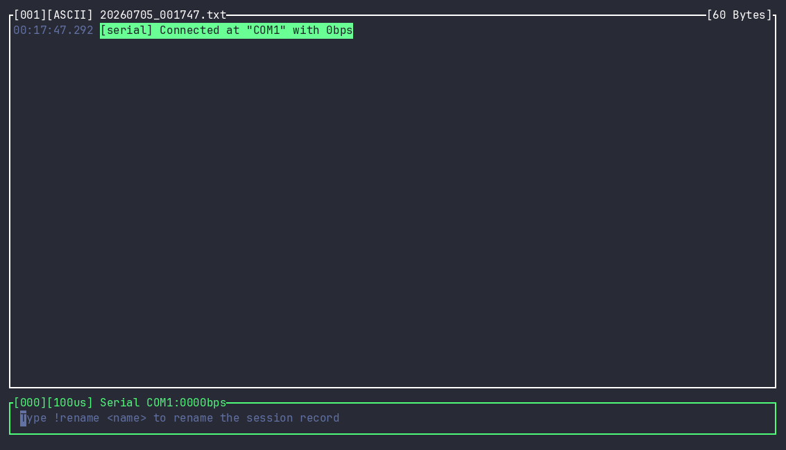
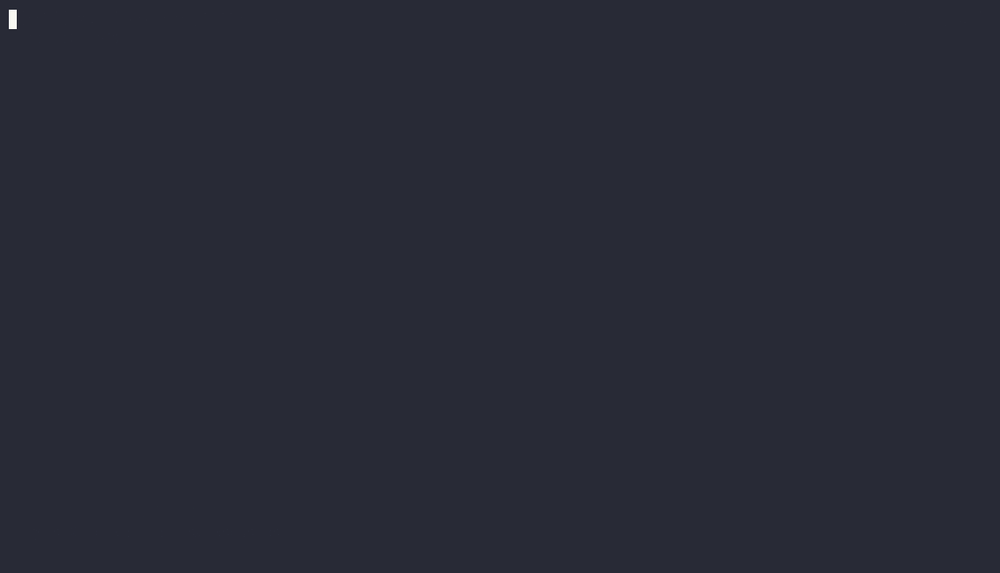

<p align="center">
    <br>
    <br>
    <a href="#license"></a>
    <a href="https://crates.io/crates/scope-monitor"></a>
    <br><b>Scope</b> is a multi-platform serial monitor with user-extensible features.
</p>

<p align="center">
    <a href="#why-scope">Why Scope</a> •
    <a href="#installation">Installation</a> •
    <a href="#quickstart">Quickstart</a> •
    <a href="#features">Features</a> •
    <a href="#command-reference">Commands</a> •
    <a href="#keyboard--mouse-shortcuts">Shortcuts</a> •
    <a href="#command-line-options">CLI</a> •
    <a href="#configuration-file">Config</a> •
    <a href="#plugins">Plugins</a> •
    <a href="#scope-vs-others">Comparison</a> •
    <a href="#troubleshooting">Troubleshooting</a>
</p>


## Why Scope

Embedded and hardware work means living in a serial monitor — and most of them either do too little (`screen`, `cat /dev/tty*`) or lock the useful parts behind a paid GUI. `Scope` is a fast, keyboard-driven terminal serial monitor that puts the everyday essentials in one place: colored send/receive with timestamps, reusable `@tags` and hex input, search, session recording, auto-reconnect, an RTT interface for embedded targets, and Lua plugins when you need to script it. It runs the same on Linux, Windows, and macOS.

## Installation

You can install `Scope` with `cargo`, download a pre-built binary, or build it from source.

### Requirements

- **Platforms:** Linux, Windows, and macOS (Apple Silicon).
- **Building from source / `cargo install`:** Rust **1.92.0** or newer.
- **RTT interface:** a debug probe supported by [`probe-rs`](https://probe.rs/) (e.g. J-Link, ST-Link, CMSIS-DAP).

### Using `cargo`

```shell
cargo install scope-monitor
```

### Pre-built binary

Download the binary for your platform from the [Releases](https://github.com/matheuswhite/scope-rs/releases) page and place it on your `PATH`.

### From source

```shell
git clone https://github.com/matheuswhite/scope-rs
cd scope-rs
cargo build --release
# the binary is at target/release/scope
```

## Quickstart

Open a serial port by passing it to the `serial` subcommand together with the baud rate:

```shell
scope serial COM3 115200        # Windows
scope serial /dev/ttyUSB0 115200  # Linux
scope list                      # not sure of the port? list the available ones
```

When the command bar at the bottom turns **green**, `Scope` is connected: it starts capturing incoming messages and lets you type and send data. Type a message and press `Enter` to send it. That's it — everything below builds on this loop.

## Features

### Sending data

#### Send Data

Type a message on the command bar (at the bottom) and press `Enter` to send it through the serial port. Every message is terminated with `\r\n`; hold `Alt` while pressing `Enter` to send the text **without** the trailing `\r\n`.


#### Send in Hexadecimal

You can also send raw bytes in hexadecimal. Type `$` and write your bytes in a hexadecimal format. Inside a `$` sequence you may use `,`, `_`, `-`, `.` and spaces as separators between bytes (they are ignored when the bytes are sent), and a new `$` starts another sequence. For example, `$48 65 6c 6c 6f`, `$48,65,6c,6c,6f` and `$48$65$6c$6c$6f` all send `Hello`.


#### Tags

Instead of retyping the same values over and over, you can define **tags** and reference them with `@`. Tags live in a YAML tag file (`tags.yml` by default, or the file passed with `-t/--tag-file`), written as a simple `name: value` map:

```yaml
reset: $01 02 03
greeting: Hello, World!
```

Typing `@reset` or `@greeting` on the command bar expands the tag to its value before sending. A tag name is delimited by whitespace, another `@`, or a `"`. Press `Tab` to autocomplete a tag name from the tag file, and the list is filtered as you type. The tag file is watched and hot-reloaded, so edits take effect without restarting `Scope`.



> [!NOTE]
> Tag values are used verbatim. Prior to v0.3.0 `Scope` had a fixed "command" syntax; it was removed and superseded by these user-defined tags.

#### Command History

You can recall data you sent earlier: press `Up Arrow` and `Down Arrow` to navigate through the history of sent messages. The history is persisted between runs in a `.scope_history` file, so it survives restarts.


#### Send a File

Use `!send_file <path>` to stream the contents of a file to the target over the active interface (serial or RTT). `Scope` reports the transfer progress and a final confirmation on the history box.


### Reading and display

#### Colorful Output

`Scope` colors the command bar to signal the status of the serial connection: red when disconnected, green when connected. The content read and written is colored too — received data follows the ANSI terminal color standard.


Data sent to the serial port always has a background to distinguish it from received data. Characters outside the printable ASCII range are shown in magenta and in hexadecimal, and a few common characters are printed as their escape representation, such as `\n`, `\r` and `\0`.


#### Message Timestamp

All data written or read carries a gray timestamp on the left, in the format `HH:MM:SS.ms`.

#### Search

Press `Ctrl+F` to enter **search mode** and type a query to find it in the captured history. Press `Enter` or `Down Arrow` to jump to the next match and `Up Arrow` for the previous one. `Ctrl+W` toggles case sensitivity, and `Esc` leaves search mode.


#### Message Filter

When received data floods the history — for example a stream of `dbg` lines — use the `!filter` and `!mute` commands to control which received messages are shown. The current filter is shown between square brackets at the top-right of the command bar (e.g. `[.*]`). The two commands share that slot, so setting one replaces the other.

- `!filter <pattern>` — **show only** received lines matching the regex `<pattern>` (like `grep`).
- `!filter` — show every received message again (reset to the default `.*`).
- `!mute <pattern>` — **hide** received lines matching `<pattern>` (the inverse of `!filter`, like `grep -v`); everything else is shown. The indicator is prefixed with `!`, e.g. `![^dbg]`.
- `!mute` — mute *every* received message (a warning is logged to make the state obvious).

Behavior to keep in mind:

- **The pattern is a regex applied per line, and matching is *not anchored*.** It succeeds when the pattern is found *anywhere* in the line, so `!filter dbg` shows every line that contains `dbg`, not only those that start with it. Anchor with `^` / `$` to match the start / end of a line — e.g. `!mute ^dbg` hides only lines that *begin* with `dbg`, and `!mute "^\[00"` hides lines beginning with `[00`.
- **Regex metacharacters must be escaped.** `[` opens a character class, so to match a literal `[` write `\[` (e.g. `^\[` matches a line starting with `[`). An invalid pattern is reported as an error and the previous filter is kept.
- **These commands only affect received (RX) data.** Data you send and system log messages (errors, warnings, connection notices…) are always shown, regardless of the filter.
- **Filtering is display-only.** Every message is still written to the session record, the crash backup and any active recording — it hides lines from the live view, it does not drop them from disk. (So checking the saved `.txt` will show hidden lines; look at the live TUI to see the effect.) Removing the filter (`!filter`) brings hidden lines back into the view.
- **The filter resets to the default `.*` at the start of each session.** It is not persisted.

#### Select, Copy and Clear

Click and drag with the mouse to select text in the history, then press `Ctrl+C` to copy the selection to the system clipboard. You can paste text into the command bar with your terminal's paste shortcut (`Scope` supports bracketed paste). `Ctrl+L` clears the screen.



### Interfaces

#### Setup Serial Port

You can change the serial port and its baud rate while the tool is open. Type `!serial connect COM4 9600` to set the serial port to `COM4` and the baud rate to `9600`. You can also omit the port to change only the baud rate (`!serial connect 9600`) or omit the baud rate to change only the port (`!serial connect COM4`). To release the serial port, type `!serial disconnect`.


You can also set hardware/software flow control with `!serial flow <none|sw|hw>` (flow control applies to serial only). When you don't want to type the interface name, the generic `!connect` and `!disconnect` commands act on whichever interface is currently active.

#### RTT Interface

Besides a serial port, `Scope` can talk to an embedded target over [RTT](https://wiki.segger.com/RTT) using [`probe-rs`](https://probe.rs/). Start it from the CLI with `scope rtt <target> <channel>` (for example `scope rtt STM32F303 0`).

While connected you can:

- `!rtt connect [<target>] [<channel>]` — connect or reconfigure the RTT session (same omit-arguments rules as `!serial connect`).
- `!rtt disconnect` — detach from the target.
- `!rtt read <address> [<size>]` — read `size` bytes (default `4`) from the target's memory. The address may be hexadecimal (`0x...`) or decimal.

#### Auto Reconnect

`Scope` has an auto-reconnect feature: when the serial port isn't available, it keeps trying to reconnect until the port comes back.


> [!NOTE]
> Auto-reconnect has some known issues on the Windows version.

### Capture and sessions

#### Save and Record

To save all the messages captured (and sent) since the start, press `Ctrl+S`. The history box blinks and a message is shown in the history. The filename appears at the top of the history box with a `.txt` extension, and the top-right corner shows the total size of the captured messages.


If you instead want to save only the messages captured *from now on*, use the record feature. Press `Ctrl+R` to start a record session: while recording, the history block turns yellow and `Scope` stores every message captured from that point. Press `Ctrl+R` again to stop. The right-corner indicator shows the size of the record session, and a new filename is created each time a record session starts. Both starting and stopping a session print a message in the history box marking when it happened.


You can rename the current session at runtime with `!rename <name>`; the save file (and any crash-recovery backup) follows the new name. To guard against an accidental close or a crash, `Scope` also mirrors the running session to a `.bkp` file under the user config directory (e.g. `~/.config/scope/backup/`), keeping the most recent backups.

### Headless mode

Passing `--headless` (e.g. `scope --headless serial /dev/ttyUSB0 115200`) drops the TUI and turns `Scope` into a transparent bridge between your terminal and the wire — like `screen`/`minicom` in raw mode. This is the mode to use when you are driving a shell over the link (so keystrokes and ANSI escapes go through untouched) or piping the output to another program (an AI assistant, a log file) that would otherwise choke on the TUI's box-drawing.

In headless mode:

- **Received bytes are written straight to stdout**, verbatim and immediately — no timestamps, no scrollback, no colouring. The device's own ANSI sequences control your terminal directly.
- **Every key you type is sent raw to the device** the moment you press it (no command-bar buffering, no local echo — the device echoes, as with any serial terminal).
- **Log messages** (connection notices, errors…) still appear inline, with a coloured background so they stand out from device output; they are never sent to the wire.
- **Scroll, search and copy are delegated to your terminal emulator** — they don't exist inside `Scope` here.
- **Nothing is written to disk** — no session record, backup, or `!record`. Redirect stdout yourself if you want a capture.

To reach the normal `Scope` commands (`!plugin`, `!connect`, `@tags`, `$hex`, history, …), press **`Ctrl+K`**: a blinking `> ` prompt (black on yellow) appears and incoming output is held back while you type. Press **Enter** to run the command (or **Esc** / an empty Enter to cancel) and return to the raw bridge. Every command available in the normal command bar works here. To **quit**, press **`Ctrl+K`** then **`Ctrl+Q`**, or run the **`!exit`** (alias `!quit`) command.

### Cross-platform

`Scope` runs on Linux, Windows, and macOS (Apple Silicon), with the same interface and behavior on each.

## Command Reference

Anything typed on the command bar that starts with `!` is a command. A line without `!` is sent as data (after expanding `@tags` and `$hex`).

| Command | Description |
|---------|-------------|
| `!serial connect [<port>] [<baud>]` | Connect/reconfigure the serial port. A numeric argument is the baud rate, otherwise it's the port; omit either to keep the current value. |
| `!serial disconnect` | Release the serial port. |
| `!serial flow <none\|sw\|hw>` | Set flow control: none, software (`sw`) or hardware (`hw`). |
| `!rtt connect [<target>] [<channel>]` | Connect/reconfigure the RTT session (numeric argument is the channel). |
| `!rtt disconnect` | Detach from the RTT target. |
| `!rtt read <address> [<size>]` | Read `size` bytes (default `4`) from target memory. Address is hex (`0x..`) or decimal. |
| `!connect` / `!disconnect` | Connect / disconnect whichever interface is currently active. |
| `!rename <name>` | Rename the current session record file (and its backup). |
| `!filter <pattern>` | Show only received messages matching the regex `<pattern>` (applied line by line, unanchored), like `grep`. Call with no argument to show everything again (reset to the default `.*`). Display-only — the session record keeps every message. |
| `!mute <pattern>` | Hide received messages matching the regex `<pattern>` (the inverse of `!filter`, like `grep -v`). Call with no argument to mute every received message (a warning is logged). Display-only — the session record keeps every message. |
| `!send_file <path>` | Stream a file to the target over the active interface. |
| `!log <module> <level>` | Set the log level. `<module>` is `system` (`sys`) or a plugin name; `<level>` is one of `debug`, `info`, `success`, `warning`, `error`. |
| `!plugin load <file>` | Load a Lua plugin from a file. |
| `!plugin reload <file>` | Reload a plugin from a file. |
| `!plugin unload <name>` | Unload a plugin by name. |
| `!<plugin> <command> [args...]` | Call a command exported by a loaded plugin (see [Plugins](#plugins)). |

## Keyboard & Mouse Shortcuts

| Shortcut | Action |
|----------|--------|
| `Enter` | Send the message / run the command. In search mode: next match. |
| `Alt`+`Enter` | Send without the trailing `\r\n`. |
| `Alt`+`Enter` (`Ctrl`+`Enter` on Windows) | In search mode: previous match. |
| `Up` / `Down` | Navigate the command history. In search mode: previous / next match. |
| `Ctrl`+`F` | Toggle search mode. |
| `Ctrl`+`W` | In search mode: toggle case sensitivity. |
| `Tab` | Autocomplete a `@tag` from the tag file. |
| `Ctrl`+`S` | Save the whole session to a `.txt` file. |
| `Ctrl`+`R` | Start / stop a record session. |
| `Ctrl`+`C` | Copy the current selection to the clipboard. |
| Terminal paste shortcut | Paste text into the command bar (via bracketed paste). |
| `Ctrl`+`L` | Clear the screen. |
| `Esc` | Leave search mode, or quit `Scope` when in normal mode. |
| `PageUp` / `PageDown` | Scroll the history one page up / down. |
| `Alt`+`PageUp` / `Alt`+`PageDown` (`Ctrl` on Windows) | Jump to the start / end of the history. |
| `Home` / `End` | Move the cursor to the start / end of the input. |
| `Ctrl`+`Left` / `Ctrl`+`Right` (`Alt` on macOS) | Move the cursor one word left / right. |
| `Backspace` / `Delete` | Delete the character before / at the cursor. |
| Mouse wheel | Scroll the history (hold `Ctrl` to scroll horizontally). |
| Mouse drag | Select text (copy it with `Ctrl`+`C`). |

## Command-Line Options

`Scope` is invoked as `scope [OPTIONS] <COMMAND>`.

Commands:

| Command | Description |
|---------|-------------|
| `serial [<port>] [<baudrate>]` | Open a serial port (e.g. `scope serial COM3 115200`). |
| `rtt [<target>] [<channel>]` | Attach to an RTT target via `probe-rs` (e.g. `scope rtt STM32F303 0`). |
| `list [-v\|--verbose]` | List the available serial ports. |
| `ble <name> <mtu>` | *(Not yet implemented.)* |

Global options (given before the command):

| Option | Default | Description |
|--------|---------|-------------|
| `-c, --capacity <N>` | `2000` | Number of scrollback lines kept in memory. |
| `-t, --tag-file <PATH>` | `tags.yml` | Path to the tag file (see [Tags](#tags)). |
| `-l, --latency <US>` | `100` | Polling latency in microseconds (clamped to `0..=100000`). |
| `-n, --name <NAME>` | timestamp | Base name for the session record file. |
| `--headless` | off | Run without the TUI as a raw terminal↔wire bridge (see [Headless mode](#headless-mode)). |

## Configuration File

The options above can also be set in an optional `config.toml` placed in your platform config directory under `scope/` (for example `~/.config/scope/config.toml` on Linux). It currently supports the `capacity` and `tag_file` fields:

```toml
capacity = 5000
tag_file = "/home/user/.config/scope/tags.yml"
```

Values resolve as **CLI flag > `config.toml` > built-in default**, so a flag always wins over the file, and the file wins over the defaults. A missing file (or a missing field) just falls back to the defaults; a malformed file or an unknown key is reported as an error. Paths are used verbatim — `~` and environment variables are **not** expanded, so use an absolute path.

## Plugins

You can extend the basic functions of `Scope` with plugins! Plugins are scripts written in the `lua` language. The code below shows a plugin that prepends `Received:` to every received message. It also prints `Hello, World!` when the user types `!echo hello` (if the plugin file is `echo.lua`).

```lua
local log = require("scope").log
local fmt = require("scope").fmt

local M = {}

function M.on_serial_recv(msg)
  log.info("Received: " .. fmt.to_str(msg))
end

function M.hello()
  log.info("Hello, World!")
end

return M
```

Load a plugin with `!plugin load <file>` (and `!plugin reload <file>` / `!plugin unload <name>` to reload or remove it). To call one of your plugin's commands, type `!` followed by the plugin name, the command name and its arguments — for example `!echo hello`. Inside a plugin you can react to lifecycle and I/O events (`on_load`, `on_unload`, `on_serial_recv`/`on_serial_send`, `on_rtt_recv`/`on_rtt_send`) and interact with `Scope` and the target: connect/disconnect, send data, read RTT memory, print messages, run shell commands and more. For the full guide see the [Plugins Developer Guide](plugins/README.md).


## Scope vs Others

`Scope` combines many features that are otherwise scattered across different tools. The table below compares them:

| Features                    | Scope (Free) | Docklight | Arduino | Tera Term | screen   | esp-idf  |
|-----------------------------|--------------|-----------|---------|-----------|----------|----------|
| Send Data                   | ✅            | ✅        | ✅       | ✅         | ✅        | ✅        |
| Send in Hexadecimal         | ✅            | ✅        | x        | x         | x        | x        |
| Tags / Macros               | ✅[^1]        | ✅        | x       | x          | x        | x        |
| Written History             | ✅            | ✅[^2]    | x        | x         | x        | x        |
| Auto Reconnect              | ✅            | ✅        | x        | ✅         | x        | x        |
| Colorful                    | ✅            | x         | x       | ✅         | ✅        | ✅        |
| Message Timestamp           | ✅            | ✅        | x        | x         | x        | x        |
| Display non-printable chars | ✅            | ✅        | x        | x         | x        | x        |
| Plugins                     | ✅            | ✅        | x        | x         | x        | x        |
| Multiplatform               | ✅            | Windows   | ✅       | Windows   | Linux    | ✅        |
| Interface                   | TUI           | GUI       | GUI     | GUI       | Terminal | Terminal |
| Price                       | Free          | €69       | Free    | Free      | Free     | Free     |

<br>[^1]: User-defined `@tags` replaced the old fixed command syntax that was removed at v0.3.0
<br>[^2]: The Docklight has a list of commands in lateral panel, so it doesn't need a command history

## Troubleshooting

**No serial ports are listed.** Run `scope list` (or `scope list -v`) to see what `Scope` detects. If your device is missing, check the cable and drivers, and make sure you have permission to access the port — on Linux your user usually needs to be in the `dialout` group (`sudo usermod -aG dialout $USER`, then log out and back in).

**Auto-reconnect misbehaves on Windows.** This is a known limitation of the Windows build; reconnect works reliably on Linux and macOS.

**RTT won't connect.** The RTT interface needs a debug probe supported by [`probe-rs`](https://probe.rs/) and the correct target chip name and channel — for example `scope rtt STM32F303 0`. Make sure the probe is connected and not held by another debugger.

**My `tag_file` / config path isn't found.** Path values are used verbatim: `~` and environment variables are **not** expanded. Use an absolute path (for example `/home/user/.config/scope/tags.yml`).

## Project Goals

This project has 5 pillars that direct the development of this tool:

I. **Intuitive Usage:** The usage of the tool must be intuitive. This means the usability should follow the common behaviors of other popular tools. For example, the history navigation (`Up Arrow` and `Down Arrow`) follows the history navigation of an OS terminal like the Unix shell or Windows PowerShell.
<br>II. **Compactness and Orthogonality:** The features must follow the [compactness and orthogonality](http://www.catb.org/esr/writings/taoup/html/ch04s02.html) principles of Unix.
<br>III. **User-Centric Development:** The development of this tool must deliver value to the user first, instead of pleasing the developers. For example, the scripting language used to extend the tool is a consolidated programming language rather than a new one, and critical bugs reported by users are prioritized over shipping new features.
<br>IV. **Multiplatform:** All releases must work on Windows, Linux (zsh, bash and fish) and macOS.
<br>V. **Extensible:** Support user scripts to extend the base functionality. These scripts are called plugins. For more information about plugins see the [Plugins Developer Guide](plugins/README.md).

The roadmap, with upcoming releases, can be found in the [GitHub project](https://github.com/users/matheuswhite/projects/5) for this tool.

## Contributing

Contributions are welcome — take a look at the [CONTRIBUTING](CONTRIBUTING.md) guide.

## Community

For new feature requests and to report a bug, feel free to open a new [issue](https://github.com/matheuswhite/scope-rs/issues) on GitHub.

## Maintainers

+ [Matheus T. dos Santos](https://github.com/matheuswhite)

## Acknowledgements

+ [Emilio Bottoni](https://github.com/MilhoNerfado) and [José Gomes](https://github.com/JoseGomesJr) for the ideas that push this tool forward, for the testing that finds hidden bugs, and for good feature implementations.

## License

`Scope` is distributed under the terms of both the MIT license and the Apache
License (Version 2.0), at your option.

See [LICENSE-MIT](LICENSE-MIT) and [LICENSE-APACHE](LICENSE-APACHE) for details.

Unless you explicitly state otherwise, any contribution intentionally submitted
for inclusion in `Scope` by you, as defined in the Apache-2.0 license, shall be
dual licensed as above, without any additional terms or conditions.
