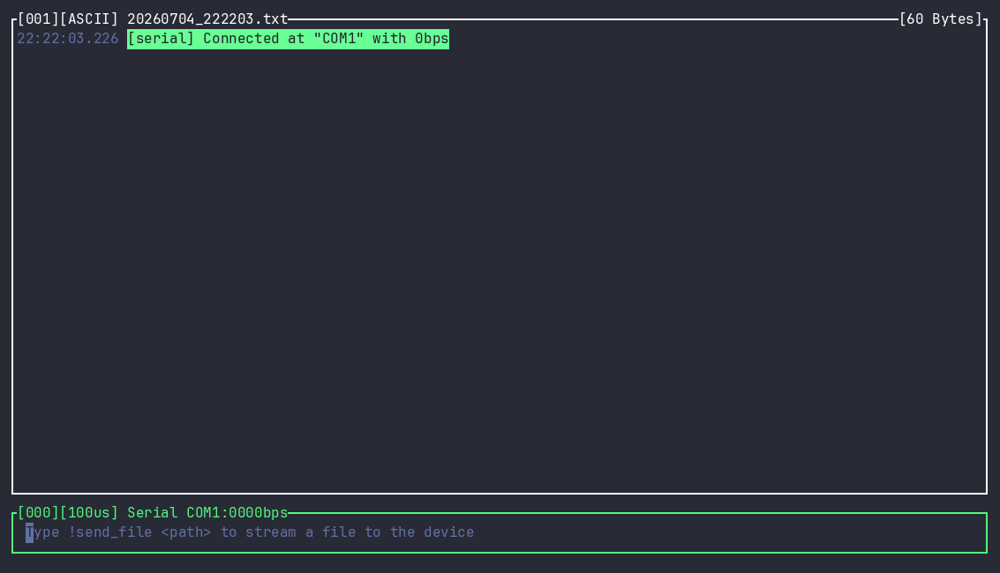
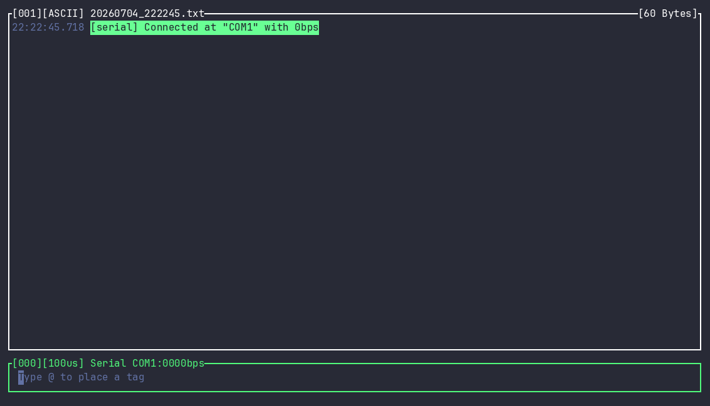
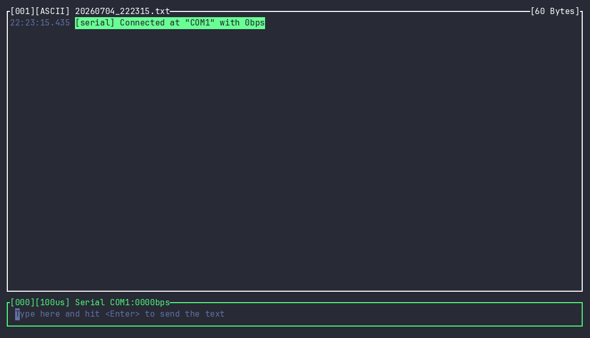
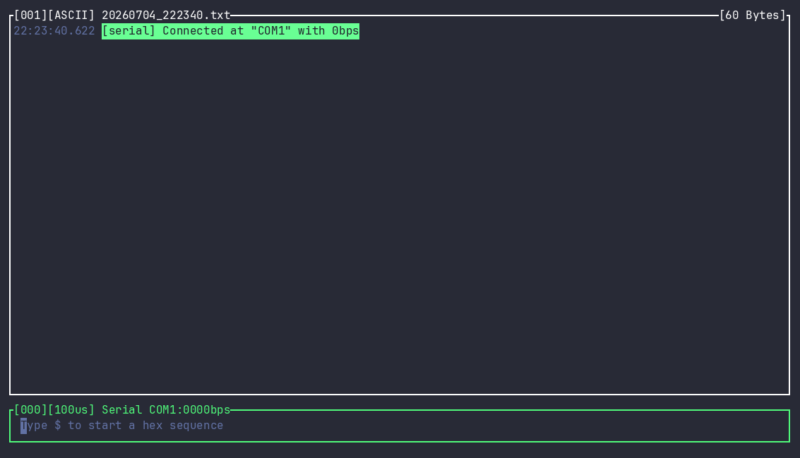

<p align="center">
    <br>
    <br>
    <a href="https://opensource.org/licenses/BSD-3-Clause"></a>
    <a href="https://crates.io/crates/scope-monitor"></a>
    <br><b>Scope</b> is a multi-platform serial monitor with user-extensible features.
</p>

<p align="center">
    <a href="#send-data">Key Features</a> •
    <a href="#command-reference">Commands</a> •
    <a href="#keyboard--mouse-shortcuts">Shortcuts</a> •
    <a href="#scope-vs-others">Scope vs Others</a> •
    <a href="#installation">Installation</a> •
    <a href="#command-line-options">CLI</a> •
    <a href="#configuration-file">Config</a> •
    <a href="#plugins">Plugins</a>
</p>

## Key Features

### Send Data

With `Scope`, you can type a message on the command bar (at bottom) and hit `Enter` to send it through the serial port. Every message is terminated with `\r\n`; hold `Alt` while pressing `Enter` to send the text **without** the trailing `\r\n`.


### Send in Hexadecimal

You also can send bytes in hexadecimal. To do it, type `$` and write your bytes in a hexadecimal format. Inside a `$` sequence you may use `,`, `_`, `-`, `.` and spaces as separators between bytes (they are ignored when the bytes are sent), and a new `$` starts another sequence. For example, `$48 65 6c 6c 6f`, `$48,65,6c,6c,6f` and `$48$65$6c$6c$6f` all send `Hello`.


### Tags

Instead of retyping the same values over and over, you can define **tags** and reference them with `@`. Tags live in a YAML tag file (`tags.yml` by default, or the file passed with `-t/--tag-file`), written as a simple `name: value` map:

```yaml
reset: $01 02 03
greeting: Hello, World!
```

Typing `@reset` or `@greeting` on the command bar expands the tag to its value before sending. A tag name is delimited by whitespace, another `@`, or a `"`. Press `Tab` to autocomplete a tag name from the tag file, and the list is filtered as you type. The tag file is watched and hot-reloaded, so edits take effect without restarting `Scope`.

> [!NOTE]
> Tag values are used verbatim. Prior to v0.3.0 `Scope` had a fixed "command" syntax; it was removed and superseded by these user-defined tags.

### Written History

It's possible to retrieve old data sent. You can hit `Up Arrow` and `Down Arrow` to navigate through the history of sent messages. The history is persisted between runs in a `.scope_history` file, so it survives restarts.



### Search

Hit `Ctrl+F` to enter **search mode** and type a query to find it in the captured history. Press `Enter` or `Down Arrow` to jump to the next match and `Up Arrow` for the previous one. `Ctrl+W` toggles case sensitivity, and `Esc` leaves search mode.

### Auto Reconnect

The `Scope` tool has an auto-reconnect feature. When the serial port isn't available, `Scope` will keep trying to reconnect to the serial port until it's available again.


> [!NOTE]
> There are some issues for auto reconnect in Windows version.

### Colorful

`Scope` colors the command bar to notify the status of the serial connection: red to disconnected and green to connected. Beyond status, the content read and written are colored too. The messages read is colored using ANSI terminal color standard.


The data sent to serial port always has a background to differentiate it from read data. Characters outside the printable range of the ASCII table are shown in magenta and in the hexadecimal format. Some characters are printed as its representation, such as: `\n`, `\r` and `\0`.



### Setup Serial Port

It's possible change serial port and its baud rate while the tool is open. To do that,
type `!serial connect COM4 9600` to set serial port to `COM4` and baud rate to `9600`. You can also omit port to change only the baud rate (`!serial connect 9600`) or omit the baud rate to change only the port (`!serial connect COM4`). If you want to release the serial port, you'll type `!serial disconnect`.


You can also set hardware/software flow control with `!serial flow <none|sw|hw>` (flow control applies to serial only). When you don't want to type the interface name, the generic `!connect` and `!disconnect` commands act on whichever interface is currently active.

### RTT Interface

Besides a serial port, `Scope` can talk to an embedded target over [RTT](https://wiki.segger.com/RTT) using [`probe-rs`](https://probe.rs/). Start it from the CLI with `scope rtt <target> <channel>` (for example `scope rtt STM32F303 0`).

While connected you can:

- `!rtt connect [<target>] [<channel>]` — connect or reconfigure the RTT session (same omit-arguments rules as `!serial connect`).
- `!rtt disconnect` — detach from the target.
- `!rtt read <address> [<size>]` — read `size` bytes (default `4`) from the target's memory. The address may be hexadecimal (`0x...`) or decimal.

### Save and Record

To save the all messages captured (and sent) since the start, you can hit `Ctrl+s`. The history box will blink and a message will be displayed on history. The filename is shown at top of history box with `.txt` extension. There is, at the history's top-right corner, the size of all message captured.



However, if you want to save only the message captured from now, you'll use the record feature. Hitting `Ctrl+r`, you'll start a record session. While in a record session, the history block is yellow and the `Scope` will store all messages captured from now. To stop the record session, you need to hit `Ctrl+r` again. The right-corner indicator will show the size of the record session. A new filename is created each time a new record session is started. Both: start session and stop session, prints a message on the history box to indicate when it occurs.


You can rename the current session at runtime with `!rename <name>`; the save file (and any crash-recovery backup) follows the new name. To guard against an accidental close or a crash, `Scope` also mirrors the running session to a `.bkp` file under the user config directory (e.g. `~/.config/scope/backup/`), keeping the most recent backups.

### Send a File

Use `!send_file <path>` to stream the contents of a file to the target over the active interface (serial or RTT).

### Select, Copy and Clear

Click and drag with the mouse to select text in the history, then press `Ctrl+C` to copy the selection to the system clipboard. `Ctrl+L` clears the screen.

### Message Timestamp

All the data written or read has a gray timestamp on the left of the message and with the following
format: `HH:MM:SS.ms`.

### Multiplatform

You can use `Scope` on multiple platforms, like: Linux, Windows and macOS (Apple Silicon).

## Command Reference

Anything typed on the command bar that starts with `!` is a command. A line without `!` is sent as data (after expanding `@tags` and `$hex`).

| Command | Description |
|---------|-------------|
| `!serial connect [<port>] [<baud>]` | Connect/reconfigure the serial port. A numeric argument is the baud rate, otherwise it's the port; omit either to keep the current value. |
| `!serial disconnect` | Release the serial port. |
| `!serial flow <none\|sw\|hw>` | Set flow control: none, software (`sw`) or hardware (`hw`). |
| `!rtt connect [<target>] [<channel>]` | Connect/reconfigure the RTT session (numeric argument is the channel). |
| `!rtt disconnect` | Detach from the RTT target. |
| `!rtt read <address> [<size>]` | Read `size` bytes (default `4`) from target memory. Address is hex (`0x..`) or decimal. |
| `!connect` / `!disconnect` | Connect / disconnect whichever interface is currently active. |
| `!rename <name>` | Rename the current session record file (and its backup). |
| `!send_file <path>` | Stream a file to the target over the active interface. |
| `!log <module> <level>` | Set the log level. `<module>` is `system` (`sys`) or a plugin name; `<level>` is one of `debug`, `info`, `success`, `warning`, `error`. |
| `!plugin load <file>` | Load a Lua plugin from a file. |
| `!plugin reload <file>` | Reload a plugin from a file. |
| `!plugin unload <name>` | Unload a plugin by name. |
| `!<plugin> <command> [args...]` | Call a command exported by a loaded plugin (see [Plugins](#plugins)). |

## Keyboard & Mouse Shortcuts

| Shortcut | Action |
|----------|--------|
| `Enter` | Send the message / run the command. In search mode: next match. |
| `Alt`+`Enter` | Send without the trailing `\r\n`. |
| `Alt`+`Enter` (`Ctrl`+`Enter` on Windows) | In search mode: previous match. |
| `Up` / `Down` | Navigate the command history. In search mode: previous / next match. |
| `Ctrl`+`F` | Toggle search mode. |
| `Ctrl`+`W` | In search mode: toggle case sensitivity. |
| `Tab` | Autocomplete a `@tag` from the tag file. |
| `Ctrl`+`S` | Save the whole session to a `.txt` file. |
| `Ctrl`+`R` | Start / stop a record session. |
| `Ctrl`+`C` | Copy the current selection to the clipboard. |
| `Ctrl`+`L` | Clear the screen. |
| `Esc` | Leave search mode, or quit `Scope` when in normal mode. |
| `PageUp` / `PageDown` | Scroll the history one page up / down. |
| `Alt`+`PageUp` / `Alt`+`PageDown` (`Ctrl` on Windows) | Jump to the start / end of the history. |
| `Home` / `End` | Move the cursor to the start / end of the input. |
| `Ctrl`+`Left` / `Ctrl`+`Right` (`Alt` on macOS) | Move the cursor one word left / right. |
| `Backspace` / `Delete` | Delete the character before / at the cursor. |
| Mouse wheel | Scroll the history (hold `Ctrl` to scroll horizontally). |
| Mouse drag | Select text (copy it with `Ctrl`+`C`). |

## Plugins

You can extend the basic functions of `Scope` using plugins! Plugins are scripts written in `lua` language. The code below shows a plugin that appends `Received:` at the beginning of received message. It also prints `Hello, World!` when the user types `!echo hello` (if the plugin file is `echo.lua`).

```lua
local log = require("scope").log
local fmt = require("scope").fmt

local M = {}

function M.on_serial_recv(msg)
  log.info("Received: " .. fmt.to_str(msg))
end

function M.hello()
  log.info("Hello, World!")
end

return M
```

Load a plugin with `!plugin load <file>` (and `!plugin reload <file>` / `!plugin unload <name>` to reload or remove it). To call one of your plugin's commands, type `!` followed by the plugin name, the command name and its arguments — for example `!echo hello`. Inside a plugin you can react to lifecycle and I/O events (`on_load`, `on_unload`, `on_serial_recv`/`on_serial_send`, `on_rtt_recv`/`on_rtt_send`) and interact with `Scope` and the target: connect/disconnect, send data, read RTT memory, print messages, run shell commands and more. For the full guide see the [Plugins Developer Guide](plugins/README.md).



## Scope vs Others

The `Scope` combine multiple features. The table below list these features:

| Features                    | Scope (Free) | Docklight | Arduino | Tera Term | screen   | esp-idf  |
|-----------------------------|--------------|-----------|---------|-----------|----------|----------|
| Send Data                   | ✅            | ✅        | ✅       | ✅         | ✅        | ✅        |
| Send in Hexadecimal         | ✅            | ✅        | x        | x         | x        | x        |
| Tags / Macros               | ✅[^1]        | ✅        | x       | x          | x        | x        |
| Written History             | ✅            | ✅[^2]    | x        | x         | x        | x        |
| Auto Reconnect              | ✅            | ✅        | x        | ✅         | x        | x        |
| Colorful                    | ✅            | x         | x       | ✅         | ✅        | ✅        |
| Message Timestamp           | ✅            | ✅        | x        | x         | x        | x        |
| Display non-printable chars | ✅            | ✅        | x        | x         | x        | x        |
| Plugins                     | ✅            | ✅        | x        | x         | x        | x        |
| Multiplatform               | ✅            | Windows   | ✅       | Windows   | Linux    | ✅        |
| Interface                   | TUI           | GUI       | GUI     | GUI       | Terminal | Terminal |
| Price                       | Free          | €69       | Free    | Free      | Free     | Free     |

<br>[^1]: User-defined `@tags` replaced the old fixed command syntax that was removed at v0.3.0
<br>[^2]: The Docklight has a list of commands in lateral panel, so it doesn't need a command history

## Installation

You can use `cargo` to install `Scope`, download a pre-built binary at [Releases](https://github.com/matheuswhite/scope-rs/releases) page, or compile it from source (using this repository).

### Using `cargo`

```shell
cargo install scope-monitor
```

## Command-Line Options

`Scope` is invoked as `scope [OPTIONS] <COMMAND>`.

Commands:

| Command | Description |
|---------|-------------|
| `serial [<port>] [<baudrate>]` | Open a serial port (e.g. `scope serial COM3 115200`). |
| `rtt [<target>] [<channel>]` | Attach to an RTT target via `probe-rs` (e.g. `scope rtt STM32F303 0`). |
| `list [-v\|--verbose]` | List the available serial ports. |
| `ble <name> <mtu>` | *(Not yet implemented.)* |

Global options (given before the command):

| Option | Default | Description |
|--------|---------|-------------|
| `-c, --capacity <N>` | `2000` | Number of scrollback lines kept in memory. |
| `-t, --tag-file <PATH>` | `tags.yml` | Path to the tag file (see [Tags](#tags)). |
| `-l, --latency <US>` | `100` | Polling latency in microseconds (clamped to `0..=100000`). |
| `-n, --name <NAME>` | timestamp | Base name for the session record file. |

## Configuration File

The options above can also be set in an optional `config.toml` placed in your platform config directory under `scope/` (for example `~/.config/scope/config.toml` on Linux). It currently supports the `capacity` and `tag_file` fields:

```toml
capacity = 5000
tag_file = "/home/user/.config/scope/tags.yml"
```

Values resolve as **CLI flag > `config.toml` > built-in default**, so a flag always wins over the file, and the file wins over the defaults. A missing file (or a missing field) just falls back to the defaults; a malformed file or an unknown key is reported as an error. Paths are used verbatim — `~` and environment variables are **not** expanded, so use an absolute path.

## How to Use

After the installation, type `scope serial` followed by the serial port and the desired baud rate. For example, to open the port `COM3` at `115200 bps` type:

```shell
scope serial COM3 115200
```

When the command bar at the bottom is green, it starts to capture messages from serial port and allows for sending messages.

## Project Goals

This project has 5 pillars that will direct the development of this tool:

I. **Intuitive Usage:** The usage of the tool must be intuitive. This means the usability should follow other popular tool's common behaviors. For example, the history navigation (`Up Arrow` and `Down Arrow`) follows the history navigation of OS terminal like in the Unix shell and in the Windows Powershell.
<br>II. **Compactness and Orthogonality:** The features must follow the [compactness and orthogonality](http://www.catb.org/esr/writings/taoup/html/ch04s02.html) principles of the Unix.
<br>III. **User Centric Development:** The development of this tool must deliver value to user in the first place, instead of pleasing the developers. For example: the script language used to extend the tool must be a consolidated programming language, instead of creating a new language. Another example is to prioritize critical bugs reported by users, instead of launch new features.
<br>IV. **Multiplatform:** All releases must work in Windows, Linux (zsh, shell and fish) and macOS.
<br>V. **Extensible:** Support user scripts to extend base functionalities. These scripts are called plugins. For more information about plugins see [Plugins Developer Guide](plugins/README.md)

The roadmap, with next releases, may be found in [GitHub project](https://github.com/users/matheuswhite/projects/5) of this tool.

## Community

For new feature requests and to report a bug, feel free to post a new [issue](https://github.com/matheuswhite/scope-rs/issues) on GitHub.

## Contributing

Take a look at the [CONTRIBUTING](CONTRIBUTING.md) guide

## Maintainers

+ [Matheus T. dos Santos](https://github.com/matheuswhite)

## Acknowledges

+ [Emilio Bottoni](https://github.com/MilhoNerfado) and [José Gomes](https://github.com/JoseGomesJr) for the ideas that pushes forward this tool, for the tests that finds hidden bugs and for good features implementations.

## License

Scope is made available under the terms of BSD v3 Licence.

See the [LICENCE](https://github.com/matheuswhite/scope-rs/blob/main/LICENSE) for license details.
